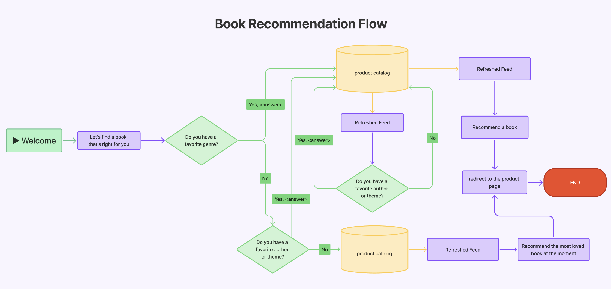

# Define Your Virtual Assistant's Objectives and Design the Conversational Flows

Designing a successful virtual assistant starts with a clear strategic foundation. Before jumping into configuration, it’s essential to understand **what your assistant should do, who it should help, and how it should interact with users**. This first step is all about defining objectives and designing effective conversational flows to guide your assistant's behavior.

## 👤 Understand User Needs

Put yourself in your users' shoes:

* What are they trying to accomplish?
* Why are they interacting with the assistant?
* Do they have concerns or expectations?

A great way to gather this insight is by analyzing past customer service tickets or emails. Talk to your customer care team to understand the most common user needs.


After the assistant is live, you should continue analyzing conversations to spot new recurring topics and improve the assistant accordingly. A truly helpful AI Agent is one that evolves with your users. This is described in detail in the last step of this practical guide: [post-go-live-monitoring-and-optimizing-your-ai-agents.md](post-go-live-monitoring-and-optimizing-your-ai-agents.md "mention").&#x20;


> 📚 **Example: Bookstore Virtual Assistant**&#x20;
>
> * Most users have questions about their order status, shipping delays, payment issues, or how to make a return.
> * Some users arrive with specific titles in mind and want help finding or ordering them.&#x20;
> * Others are browsing and might appreciate reading suggestions.

## 🎯 Define Your Goals

After having more clarity on your user pain points and request volume drivers, we can state the **objective** of your assistant. What problem is it solving? What outcomes do you expect? Are you aiming to reduce support ticket volume, boost conversions, or provide product recommendations?

Setting a clear goal helps you:

* Prioritize which user needs to address first.
* Define the assistant’s scope.
* Measure its impact post-launch.
* Align your assistant’s identity (tone, behavior, etc) with business needs.

> 📚 **Example: Bookstore Virtual Assistant**&#x20;
>
> Two key goals:
>
> 1. **Reduce the volume of support tickets** by automatically answering common user questions related to orders, payments, shipping, returns and refunds
> 2. **Enhance user engagement and drive conversions** by helping visitors discover books they’ll love through personalized recommendations based on their preferences.&#x20;

## 💬 Map Out What the Assistant Can (and Can’t) Do

Be clear about what your assistant is allowed to do. This prevents confusion and ensures a smooth user experience. Clarify the assistant’s capabilities from the start:

* What actions can it perform?
* What information does it need to ask from the user?
* What should it not do?

> 📚 **Example: Bookstore Virtual Assistant**&#x20;
>
> * ✅ It **can answer FAQs** about orders, returns, payments, and shipping.
> * ✅ The assistant **can recommend books** by asking questions (genre, language, book length).
> * ✅ It **can collect information** to open a support ticket.
> * ❌ It **cannot finalize purchases** or **add books to the cart**.

## 🧭 Design the Conversation Flows

Once you’ve defined your assistant’s goals and capabilities, the next step is to design the **conversational flows:** the **step-by-step dialogues that guide users** toward a resolution or specific outcome.

Each flow represents a **logical path that users follow** based on their needs and inputs.&#x20;

You’re essentially defining **how the assistant will interact** with users: what it will ask, how it will respond, and what it will do with the information it gathers.

#### 🧩 Start with a Flowchart

We strongly recommend designing each conversational flow using a flowchart to **visually map out each conversation**. This helps you clearly define:

* The **entry and exit points** of each flow (e.g., "User asks for book help" → "User receives recommendation")
* The **key decision points** (e.g., “Did the user provide all the required data to open a customer service ticket?”)
* **Define conditional logic**, ensuring the assistant adapts based on user choices or missing information.

Using a flowchart allows you to clearly map how each step connects to the next, especially useful when dealing with **multi-step dialogues, fallback paths, or escalations**.

#### 📌 Identify the Required Data

As you design each flow, it’s crucial to determine what **information the assistant needs** to function effectively. This could include:

* **User-provided inputs** (e.g., email, order number, preferences)
* Content from your [**knowledge base**](create-your-knowledge-base/) (e.g., FAQs)
* Dynamic data retrieved through [**external integrations**](../getting-started/integrations.md), like product catalogs or CRM databases.&#x20;

Mapping out these data points and dependencies in advance ensures that the assistant asks the right questions and pulls the right information at the right time.


When planning flows, always remember the assistant’s primary objective. For instance, if the assistant’s goal is to reduce support tickets, design flows to handle user requests independently first—only escalate to human support after a second request or when strictly necessary.


> 📚 **Example: Bookstore Virtual Assistant**
>
> **🛒 Post-Sales Assistance Flow**
>
> * **Goal:** Help users resolve order-related issues and reduce incoming support tickets.
> * **Key Data Needed:**
>   * **FAQ articles** to provide self-service support on common post-sales topics such as shipping delays, return policies, payment issues, and refund procedures.
>   * **User-provided data** for ticket creation: email address, order number, detailed description of the issue encountered.&#x20;
> * **Steps Overview:**
>   1. **Detect the user’s intent** – e.g., they mention an issue with a delivery or payment.
>   2. **Provide self-service support** – use knowledge base content to answer FAQs (e.g., refund policies, delivery times).
>   3. **Escalate only if needed** – if the user insists or the query can’t be resolved automatically, collect:
>      1. User’s **email address**
>      2. **Order number**
>      3. **Description** of the problem
>   4. **Trigger ticket creation** – automatically send the information to the support team.
>   5. **Confirm ticket submission** – reassure the user that the issue has been reported.
>
> **📖 Book Recommendation Flow**
>
> * **Goal:** Help users discover books they’ll love, increasing engagement and sales.
> * **Key Data Needed:**&#x20;
>   * **User input**: The assistant must ask targeted questions to understand the user's preferences, such as:
>     * Preferred **genre** (e.g., thriller, fantasy, romance)
>     * **Language** (e.g., Italian, English)
>     * Desired **book length** (short stories, long reads)
>     * Favorite **authors** or **themes**
>   * **External data**: The assistant must connect dynamically to the bookstore's **product catalog** or **eCommerce platform** to fetch real-time book availability and details.
> * **Steps Overview:**
>   1. **Ask for preferences** – genre, language, author, topic, book length, etc.
>   2. **Connect to the product catalog** – pull real-time data from the bookstore's eCommerce platform to filter and retrieve book options.&#x20;
>   3. **Return tailored suggestions** – recommend books based on the user's inputs.
>   4. **Encourage next steps** – suggest buying options or redirect to the product page.

<figure><figcaption>
Flowchart Example
</figcaption></figure>

## ✅ What Comes Next?

Now that you’ve defined your assistant’s goals and planned your flows, it’s time to:

1. [**Create Your Knowledge Base**](create-your-knowledge-base/) – Build the foundation of the assistant’s knowledge. Integrate or upload the content the assistant needs to answer questions effectively.
2. [**Configure Your AI Agents in the Platform**](configure-your-ai-agents.md) – Set up the agents and workflows in your workspace based on the flows you’ve designed.
