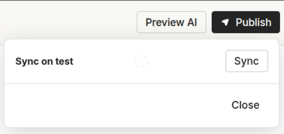

# Enterprise Architecture

The Enterprise Architecture is based on up to **five distinct environments**, each with its own infrastructure and network isolation.
\
Each environment represents a stage in the release lifecycle, from development through to production.
\
This architecture is a well-established best practice because it:

* reduces the risk of introducing errors into production;
* enables **progressive and structured testing** across multiple stages;
* maintains a clear **separation of responsibilities** between those who develop, those who validate, and those who approve;
* supports compliance with **security** and **quality standards** and **audits** (e.g. ISO, industry regulations).

### Purpose of the five environments

1. **DEV**
   \
   Active development environment where changes, updates, and optimizations are made.
   \
   Content and configurations may be unstable.
2. **TEST**
   \
   Environment used by QA for automated, integration, and regression testing.
   \
   Data must be synthetic or anonymized.
3. **UAT** (User Acceptance Test)
   \
   Environment dedicated to functional validation by key users and internal stakeholders.
   \
   It is used to confirm that the solution meets the defined requirements.
4. **STAGING**
   \
   Pre-production environment, almost identical to production.
   \
   Used for end-to-end testing, configuration checks, and go-live simulations.
5. **PRODUCTION**
   \
   Live environment used by end users.
   \
   Requires maximum stability, continuous monitoring, and strict security controls.

#### Summary table

| Environment    | Purpose               | Users                       | Notes                             |
| -------------- | --------------------- | --------------------------- | --------------------------------- |
| **DEV**        | Development           | Implementation / Developers | Variable and editable environment |
| **TEST**       | Technical validation  | QA / Testers                | Automated and integration testing |
| **UAT**        | Functional validation | Business / Owners           | Requirement verification          |
| **STAGING**    | Pre-production        | DevOps / Final QA           | Production replica                |
| **PRODUCTION** | Live execution        | End users                   | Stability, logging, security      |

### Publishing workflow

Content is created and modified exclusively in DEV.
\
Promotion across environments occurs via workspace cloning following this flow:

>
> DEV → TEST → UAT → STAGING → PRODUCTION


In all environments after DEV, workspaces are read-only.
\
Each environment has a specific set of permissions and roles.

### Synchronization and Publishing workflow

Content is not transferred between environments through direct edits, but via a workspace **synchronization (Sync) mechanism**.

#### Environment synchronitation

In the DEV, TEST, UAT, and STAGING environments, promotion to the next environment is performed using the Sync button.

\

The Sync action allows you to:

* copy workspace content to the next environment;
* ensure consistency across agents, workflows, variables, and configurations;
* maintain version control throughout the entire release lifecycle.

`DEV → TEST → UAT → STAGING → PRODUCTION`

#### Publishing to production

In the PRODUCTION environment, content is made live using the Publish button, which:

* activates configurations for end users;
* represents the final step of the standard release lifecycle

`DEV → TEST → UAT → STAGING → PRODUCTION`&#x20;

.png>)

### Managing production hotfixes

In the PRODUCTION environment, the Publish button can also be used to apply hotfixes directly in production, in exceptional and controlled cases.
\
In this scenario:

* the hotfix is applied and published directly in PRODUCTION;
* the change is not automatically propagated to other environments;
* the hotfix must be manually recreated in DEV;
* it must then be promoted via Sync through the standard flow.

This approach allows you to:

* respond quickly to critical issues;
* maintain structural alignment across environments;
* avoid untracked divergences between development and production.

> **Key rule**
> \
> **Sync** is the standard mechanism for promotion across environments.
> \
> **Publish** in production is reserved for go-live and exceptional hotfixes.

#### Content included in publishing

* Agents (instructions, behavior, fallback, tone)
* Workflows
* Knowledge Base
* API configurations / integrations
* Widget and channel configurations

#### Content excluded from publishing

* Conversation history (chats)
* Analytics
* Evaluators
* Guardrails
* Issues
* Secrets

### Variable management

Variables follow a specific handling model compared to other content.
\
Since variables can be used to centralize recurring configurations (e.g. API endpoints, integration parameters, shared URLs), it is always possible to modify the default value even in higher environments.

.png>)


\
This approach allows you to:

* avoid endpoint duplication within API blocks;
* quickly adapt configurations across different environments;
* avoid blocking operational work during advanced testing or production phases.

The structure of the variable (name, type, usage within workflows) remains governed by the synchronization flow across environments.
\
Only the default value can be updated locally in higher environments.


\
**This ensures architectural control while still providing the flexibility required for environment-specific configurations.**
