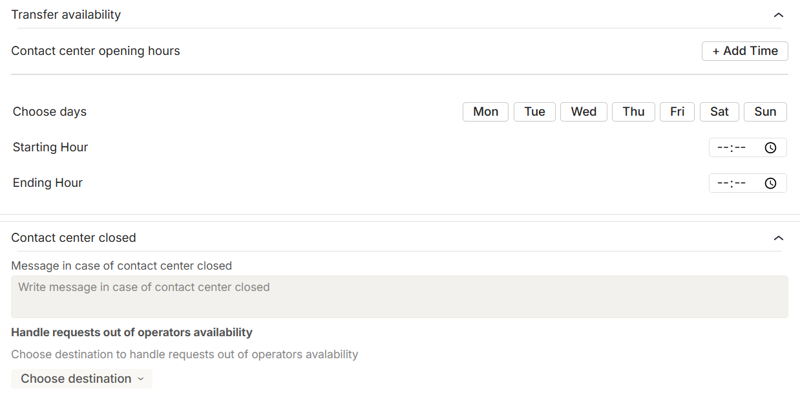

# Transfer call Block

The Transfer Call block allows you to **hand over a voice call from the virtual assistant to an external phone number.** It manages not only the redirection itself, but also the user experience during the waiting time and the fallback behaviors in case of errors or unavailability.

<figure><figcaption></figcaption></figure>

This block is designed to provide operational flexibility, a customizable experience, and complete handling of common use cases.

### Transfer Call Block: Functional Requirements

* **Availability**: The block is available among the Action blocks and can only be used in voice workflows via phone calls. In all other contexts, it is skipped.
* **Destination number**:
  * You can configure either a static phone number or a dynamic variable (e.g., \{{service\_number\}}) that will be resolved at runtime.
  * If the number is invalid, or the variable does not contain a valid number, the transfer fails and the fallback path is triggered.
* **Waiting experience**:
  * You can upload or select a music-on-hold file, which will play while the user waits for the call to be transferred.
  * Music plays until the transfer either succeeds or fails.
  * You can also add a custom waiting message to inform the user that the transfer is in progress.
*   **Availability rules:**

    * You can define time slots and weekdays when the number is available (e.g., Mon–Fri, 09:00–18:00).

    * Requests outside these time slots can be managed with a custom message and an alternative reroute.
    * Availability rules follow the same logic as the Handover block: the system applies the union of all defined time slots.
    * Predefined closure days can be managed through the workspace settings.

<figure><figcaption></figcaption></figure>

* **Error handling:**
  * If the transfer fails (e.g., due to invalid number, unreachable line, or system error), the block can trigger an alternative reroute.\

<figure><figcaption></figcaption></figure>

* File formats: Only valid and pre-approved formats can be used for background music files.

### ⚠️ Limitations&#x20;

* The block is executed only in voice workflows via phone call.
* In text chats or web calls, the block is automatically skipped and the user is informed.
* A transfer can only succeed if the destination number is valid and available at the time of execution.

### ✅Best Practice

Always configure a fallback path: if the transfer cannot be completed, make sure the user is redirected to an alternative flow instead of being left with a dropped call.

