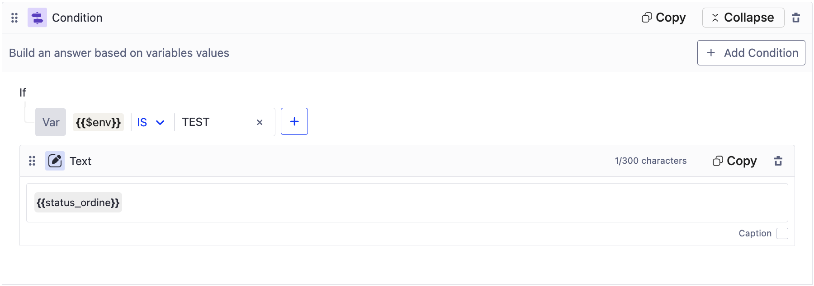
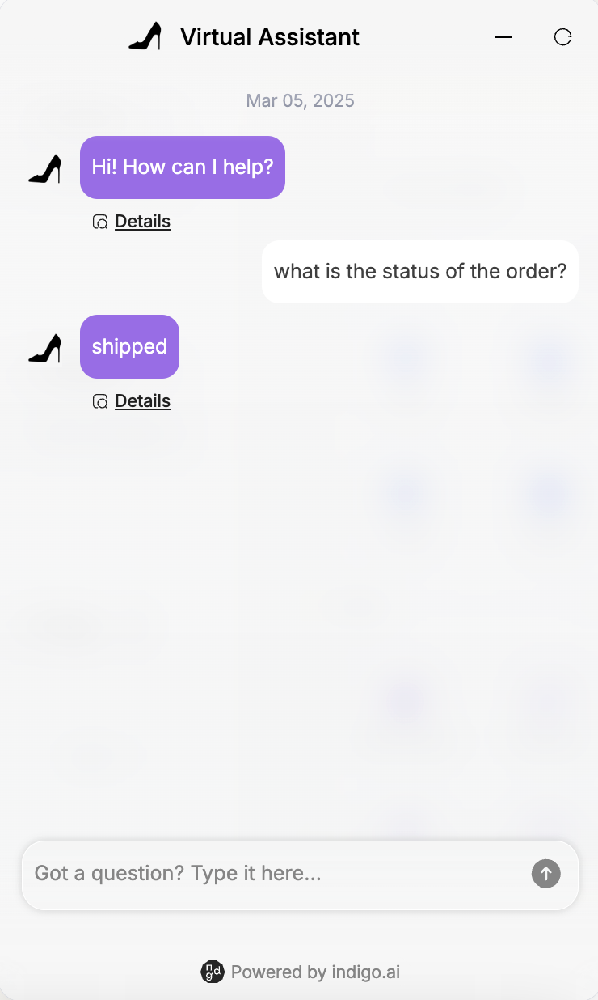
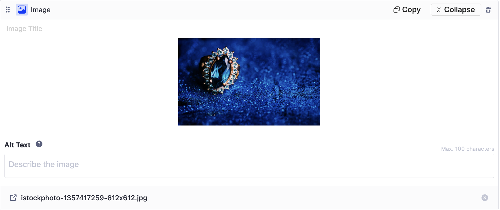
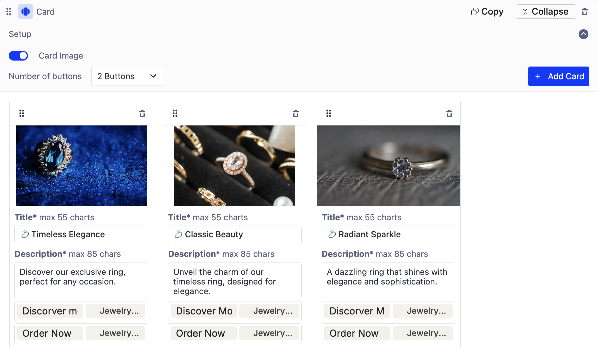

# Message Blocks

Message blocks enable you to design engaging interactions within your virtual assistant, enhancing user experience, ensuring smoother dialogue, and delivering clear, structured content.

These blocks are designed to **share content that is not dynamically generated by AI** but instead follows a predefined format. They are particularly useful when you need when you need to **present static or structured content** at specific points in the conversation flow.\
\
There are four main types of message blocks:&#x20;

1. Text Block - Sending predefined messages
2. Image Block - Displaying visual content
3. Card Block - Presenting structured, interactive content
4. Video Block - Embedding multimedia content.

## ✍️ Text Block: Sending Predefined Messages

The text block enables the virtual assistant to send specific, static messages to users.

#### **Key Features**

* Supports messages **up to 300 characters**.
* Can be displayed as a standard virtual assistant response or as a **caption** (smaller text below the bot’s main response).

#### **Common Use Cases**

* **Welcome Message**: A warm greeting when users start a conversation. This message typically introduces the virtual assistant and explains its features.&#x20;


💡 Tip: If your response exceeds 300 characters, you can split it into multiple text blocks. However, we recommend using a maximum of 3 blocks (900 characters total) to keep messages concise and readable within a chat format.&#x20;


<figure><figcaption>
Welcome Text Messages
</figcaption></figure>


_The welcome message is one of the first things to configure when building an AI agent. It is included by default in every workspace. Learn more in our step-by-step guide:_ [configure-your-ai-agents.md](../../build-your-ai-agents/configure-your-ai-agents.md "mention").


* **Conditional Responses**: A Text Block can be used **within a Condition Block** to display specific messages based on predefined variables.

> _Example_&#x20;
>
> _Scenario: A virtual assistant that provides order status updates based on the user's order status._
>
> * _If order\_status = "shipped", then display: "📦 Your order has been shipped! You can track it using this link: \[tracking\_link]."_
> * _If order\_status = "processing", then display: "⏳ Your order is currently being processed. We’ll notify you once it’s shipped!"_
> * _If order\_status = "delayed", then display: "⚠️ We’re sorry! Your order is delayed due to unexpected circumstances. Our support team is here to help if you need more details."_

* **Debugging**: A Text Block can be particularly useful for debugging when placed inside a Condition Block.&#x20;

<figure><figcaption>
Text Block within a Condition Block
</figcaption></figure>

<figure><figcaption>
Text shown during the conversation after a condition is met
</figcaption></figure>

By using the `$env` variable, which differentiates between test and live environments, you can display debugging information as a text caption when `$env = test`.

This allows you to show internal notes that help track which agent is responding or which workflow triggered a specific reply. If `$env = production`, the debugging text is not shown, ensuring a clean user experience.

> _Example: If $env = test, display: "Response generated by \[Agent Name]"_


Learn more about Condition Blocks, Variables, and Debugging at these links: [condition-block.md](logic-blocks/condition-block.md "mention"), [variables](variables/ "mention"), [testing-and-debugging.md](../../build-your-ai-agents/testing-and-debugging.md "mention").


## 🖼️ Image Block: Visual Content to Enhance Conversations

<figure><figcaption>
Image shared within the conversation
</figcaption></figure>

<figure><figcaption>
Image Block
</figcaption></figure>

The Image Block lets you insert images into the virtual assistant to make interactions more visually appealing and intuitive. Images can be uploaded in two ways:

* **Direct upload**: Upload an image from your device.
* **URL insertion**: Use an externally hosted image.

#### Requirements

* Maximum file size: 5 MB
* Supported formats: PNG, JPEG, GIF
* Alt text (up to 100 characters) can be added for accessibility and to describe the image content (not visible in web chat).

#### Common Use Cases

* Product showcase: Display images of a product in an e-commerce virtual assistant.&#x20;
* Instructional Guides & How-Tos Provide step-by-step visual guides for tasks or troubleshooting.
* Visual FAQs & Support: Simplify explanations with diagrams, infographics, or screenshots.
* Event Invitations & Announcements: Share posters, event banners, or promotional visuals.

## 📌 Card Block: Structured and Interactive Content


Cards displayed in a chat conversation


<figure><figcaption>
Card Block
</figcaption></figure>

Cards are structured content elements that combine images, text, and interactive buttons to present information in a clear and engaging format.&#x20;

When you create multiple cards (up to 10), they are displayed in a **carousel** format, allowing users to scroll through them horizontally. You can easily reorder cards using the drag-and-drop functionality, making it simple to customize the presentation order.

#### Card Configuration Options

* **Image** (Optional): The maximum height for an image in a Card Block is 244px per card. When multiple cards are displayed in a carousel view, the image will be automatically adjusted to a 16:9 aspect ratio to maintain visual consistency.
  * Image ALT text (Optional): Descriptive text for accessibility (not visible in web chat).
* **Title** (Mandatory): Up to 55 characters, concise and engaging.
* **Description** (Mandatory): Up to 85 characters (maximum 3 lines of text).
* **Buttons** (Optional): Up to 2 buttons per card (label max: 20 characters). Buttons can **link to internal workflows or agents or external pages**. All cards in a carousel must have the same number of buttons.

#### Common Use Cases

* Product Highlights: Showcase key services or items with images, descriptions, and purchase buttons.
* Interactive Menus: Guide users through conversation options.
* Promotional Offers: Feature discounts with links to dedicated landing pages.
* Guided User Journeys: Help users explore topics while maintaining conversation flow.

## 🎥 Video Block: Multimedia Content

<figure><figcaption>
Video Block
</figcaption></figure>

<figure><figcaption>
Video shared within the conversation
</figcaption></figure>

The Video block allows you to embed videos via URL, enriching the user experience with dynamic and easy-to-understand content. Supported platforms include:

* YouTube
* Wistia
* Vimeo
* Google Drive.&#x20;

You can also add an ALT text (max 100 characters) to describe the video’s content or purpose.

#### Common Use Cases

* Tutorials: Help users complete complex actions with step-by-step video instructions.
* Product demos: Showcase products or services in action.
* Explainer videos: Answer FAQs with visual demonstrations.
