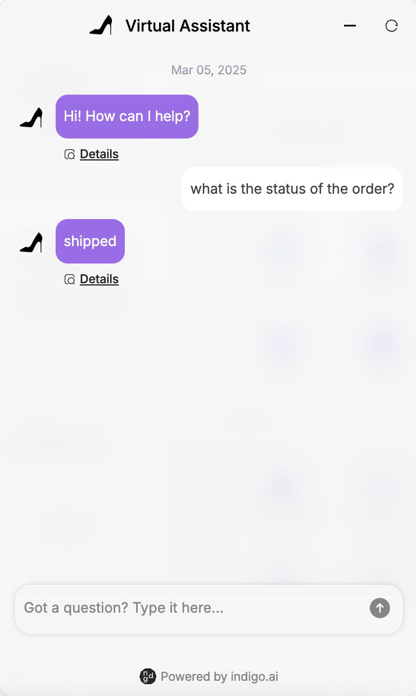

# ✍️ Text Block

## Sending predefined messages

The text block enables the virtual assistant to send specific, static messages to users.

#### **Key Features**

* Supports messages **up to 300 characters**.
* Can be displayed as a standard virtual assistant response or as a **caption** (smaller text below the bot’s main response).

#### **Common Use Cases**

* **Welcome Message**: A warm greeting when users start a conversation. This message typically introduces the virtual assistant and explains its features.&#x20;


💡 Tip: If your response exceeds 300 characters, you can split it into multiple text blocks. However, we recommend using a maximum of 3 blocks (900 characters total) to keep messages concise and readable within a chat format.&#x20;


<figure><figcaption>
Welcome Text Messages
</figcaption></figure>


_The welcome message is one of the first things to configure when building an AI agent. It is included by default in every workspace. Learn more in our step-by-step guide:_ [configure-your-ai-agents.md](../../../build-your-ai-agents/configure-your-ai-agents.md "mention").


* **Conditional Responses**: A Text Block can be used **within a Condition Block** to display specific messages based on predefined variables.

> _Example_&#x20;
>
> _Scenario: A virtual assistant that provides order status updates based on the user's order status._
>
> * _If order\_status = "shipped", then display: "📦 Your order has been shipped! You can track it using this link: \[tracking\_link]."_
> * _If order\_status = "processing", then display: "⏳ Your order is currently being processed. We’ll notify you once it’s shipped!"_
> * _If order\_status = "delayed", then display: "⚠️ We’re sorry! Your order is delayed due to unexpected circumstances. Our support team is here to help if you need more details."_

* **Debugging**: A Text Block can be particularly useful for debugging when placed inside a Condition Block.&#x20;

<figure><figcaption>
Text Block within a Condition Block
</figcaption></figure>

<figure><figcaption>
Text shown during the conversation after a condition is met
</figcaption></figure>

By using the `$env` variable, which differentiates between test and live environments, you can display debugging information as a text caption when `$env = test`.

This allows you to show internal notes that help track which agent is responding or which workflow triggered a specific reply. If `$env = production`, the debugging text is not shown, ensuring a clean user experience.

> _Example: If $env = test, display: "Response generated by \[Agent Name]"_


Learn more about Condition Blocks, Variables, and Debugging at these links: [condition-block.md](../logic-blocks/condition-block.md "mention"), [variables](../variables/ "mention"), [testing-and-debugging.md](../../../build-your-ai-agents/testing-and-debugging.md "mention").

