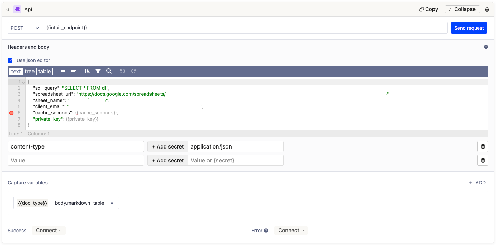

# 🌐 API Block

The API Block is one of the most powerful and flexible tools available on the indigo.ai platform. It allows you to **connect your virtual assistant with external systems**—such as CRMs, ERPs, e-commerce platforms, or internal databases—by **sending and receiving real-time data via standard API calls**.


Want to see what kind of systems you can connect to? Learn more about all available integrations here: [integrations](../../integrations/ "mention").&#x20;


<figure><figcaption></figcaption></figure>

This block plays a key role in **enabling dynamic, data-driven responses** and **automating complex business workflows** within your assistant.

Here are a few examples of what you can achieve with the API Block:

* Fetch product availability from your e-commerce system
* Retrieve user information from your CRM
* Create a support ticket in your helpdesk platform
* Check appointment availability in your calendar system
* Validate discount codes or vouchers in real time.&#x20;


💡Before using the API Block, we recommend reading the [variables](../../workspace/variables/ "mention") article. Variables are essential for capturing, storing, and reusing the data returned from your API calls.


## Block Layout and Key Components

Here’s a breakdown of the API Block interface and what each section does:

#### 1. **Method and URL**

At the top of the block, you can define:

* The **HTTP method**, i.e. the **type of action you want to perform**:
  * **GET** – Retrieves data from an external system.\
    &#xNAN;_&#x55;se this to fetch information like user details, order status, or product availability._
  * **POST** – Sends new data to an external system.\
    &#xNAN;_&#x55;se this to create a new record, such as submitting a contact form, placing an order, or opening a support ticket._
  * **PUT** – Updates an existing record with new data.\
    &#xNAN;_&#x55;se when you want to replace an entire object or resource (e.g., updating a user profile)._
  * **PATCH** – Modifies part of an existing record.\
    &#xNAN;_&#x49;deal for partial updates, such as changing only the user's email or status._
  * **DELETE** – Removes a record from an external system.\
    &#xNAN;_&#x55;se when you need to delete items like a user entry, ticket, or product._
  * **COPY** – Duplicates an existing resource.\
    &#xNAN;_&#x52;arely used, but useful in cases where cloning objects is supported by the API._
  * **HEAD** – Retrieves headers (metadata) without the response body.\
    &#xNAN;_&#x54;ypically used for quick checks, such as verifying if a resource exists._
  * **OPTIONS** – Returns allowed methods and CORS settings for an endpoint.\
    &#xNAN;_&#x50;rimarily used in API testing and setup._

<figure><figcaption></figcaption></figure>

* The **URL** of the **API endpoint**. You can insert the url directly, or insert a variable containing the URL endpoint.&#x20;

<figure><figcaption></figcaption></figure>

#### 2. **Headers and Body**

<figure><figcaption></figcaption></figure>

This section is where you define the format and structure of your API request. It includes:

* **Use JSON Editor (Optional)**

If your request body is in JSON format, you can activate the **"Use JSON editor"** checkbox to enter your payload directly in a structured way. Otherwise, you can type it manually into the **Body** field below.

* **Body Field**

This is where you write the request body (typically required for `POST`, `PUT`, or `PATCH` requests). If you're sending data to an external system—for example, submitting a form or updating a record—this is where you define the content to be sent.

* **Headers**

Use headers to define metadata or authorization info for your request. Common headers include:

* `Content-Type`: Usually set to `application/json` to indicate the body format.
* `Authorization`: Used for passing tokens or API keys.

Each header field has two parts: **Key** (e.g., `content-type`, `authorization`) and **Value** (e.g., `application/json`, `Bearer your-token-here`).&#x20;


To protect sensitive information—such as API keys or authentication tokens—you can use **Secrets**. These are securely stored values that you define in advance and reference within your API block using a protected syntax. This approach ensures that confidential credentials are never exposed in your workflow configuration, keeping your setup both clean and secure. Learn more about how to manage and use secrets here:[secrets-management-protecting-your-sensitive-information.md](../../security-compliance-and-trust/secrets-management-protecting-your-sensitive-information.md "mention").&#x20;


#### 4. **Capture Variables**

This section allows you to **extract and store values from the API response into predefined variables**. You simply:

* Choose the variable you want to populate
* Specify the key from the response JSON (e.g., `order_status`, `user_id`, etc.) This makes the returned data usable in the next steps of your flow.

<figure><figcaption></figcaption></figure>


When **testing** with "Send Request," simply click on the field you want to capture, and it will automatically copy the corresponding **path**. You can then **paste this path into the variable field** to capture the data.


#### 5. **Success and Error Paths**

At the bottom, configure what happens next based on the outcome of the API call:

* **Success**: Use the dropdown next to “Success” to choose where to route the conversation when the API request returns a successful response. You can connect this to an agent or workflow in your workspace.
* **Error**: Define fallback actions if the API call fails (e.g., showing an error message, rerouting the conversation). If you don’t specify a connection here, the assistant will automatically show a default error message: _“Something went wrong, try again.”_

If you don’t define either a success or error path, the flow will simply continue with the next block in the workflow.

<figure><figcaption></figcaption></figure>

#### "Send request" Button

<figure><figcaption></figcaption></figure>

The Send request button allows you to **test the API call directly from the platform** while you're configuring the block. This is especially useful for checking whether:

* The endpoint URL is correct
* The headers and body are properly formatted
* The request returns the expected response.&#x20;


If the Send Request fields are unchanged, click "**Re-send request**" at the bottom of the modal to **ensure the result is updated and not the same as the previous call**.


<figure><figcaption></figcaption></figure>

## Best Practices

* **Always test your calls in the preview environment first** to make sure data is being retrieved and stored correctly
* **Use** [**secrets**](../../security-compliance-and-trust/secrets-management-protecting-your-sensitive-information.md) **for sensitive keys** to keep your configuration secure
* **Check error paths** to ensure users are guided properly in case something goes wrong.&#x20;

## 📊 API Integration with a Google Sheet

We provide an **internal API** that allows you to run SQL queries on a Google Sheet, managing access via Google authorization. This is especially useful when your assistant needs to access structured data stored in spreadsheets, like product lists, contact directories, or configuration tables.&#x20;

It’s also a common and effective way to connect your Knowledge Base to the platform using real-time data.


Learn more about integrating your Knowledge Base in this article: [integrating-your-kb-via-api.md](../../../build-your-ai-agents/create-your-knowledge-base/integrating-your-kb-via-api.md "mention").&#x20;


You can choose between:

* **Public Google Sheets** (shared via link with anyone)
* **Private Google Sheets**, accessed securely via a Google Service Account

<figure><figcaption></figcaption></figure>

The integration supports parameters such as:

* `spreadsheet_url`: the full URL of the Google Sheet
* `sheet_name`: the specific sheet tab to query
* `sql_query`: the SQL-style query to run on the spreadsheet data
* `client_email` and `private_key`: credentials for accessing private sheets through a Google Service Account (added securely using the Secret feature).&#x20;


To access this internal service, please [contact us](../../../need-help/our-customer-success-team.md).


#### Using Integration Tools in the API Block

The API block supports not only custom API calls but also **preconfigured actions** from the tools enabled in the **Integrations** section.\
To use them, activate the **Use integrations** toggle inside the API block.

Once the toggle is on, you can select a **provider** and the **specific action** to execute.\
Keep in mind that each API block can run **only one action per integration**.

<figure><figcaption></figcaption></figure>

<figure><figcaption></figcaption></figure>
