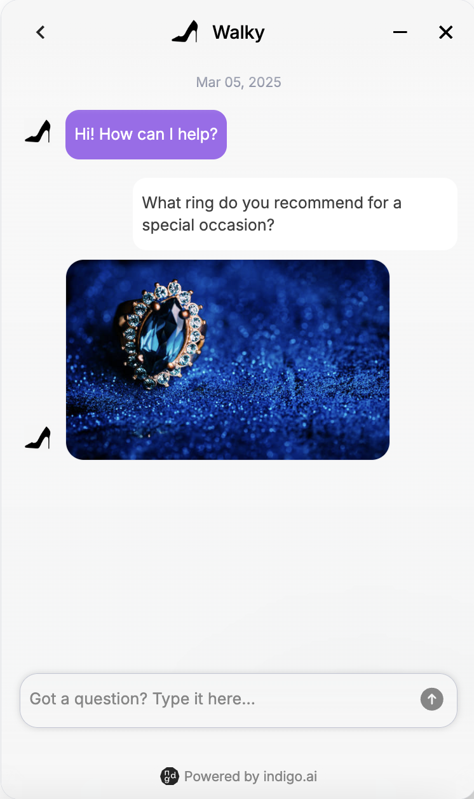

# 🖼️ Image Block

## Visual Content to Enhance Conversations

The Image Block lets you insert images into the virtual assistant to make interactions more visually appealing and intuitive.&#x20;

<figure><figcaption>
Image shared within the conversation
</figcaption></figure>

<figure><figcaption>
Image Block
</figcaption></figure>

Images can be uploaded in two ways:

* **Direct upload**: Upload an image from your device.
* **URL insertion**: Use an externally hosted image.

#### Requirements

* Maximum file size: 5 MB
* Supported formats: PNG, JPEG, GIF
* Alt text (up to 100 characters) can be added for accessibility and to describe the image content (not visible in web chat).

#### Common Use Cases

* Product showcase: Display images of a product in an e-commerce virtual assistant.&#x20;
* Instructional Guides & How-Tos Provide step-by-step visual guides for tasks or troubleshooting.
* Visual FAQs & Support: Simplify explanations with diagrams, infographics, or screenshots.
* Event Invitations & Announcements: Share posters, event banners, or promotional visuals.
