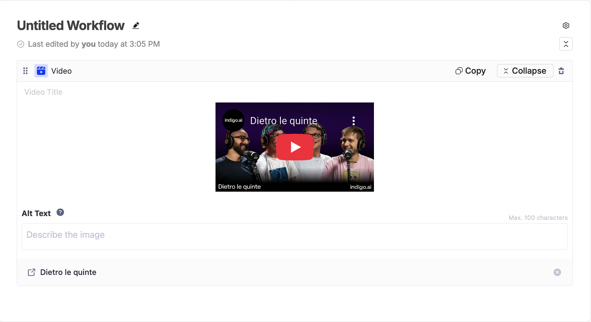
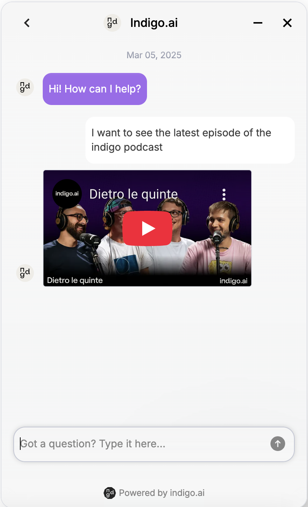

# 🎥 Video Block

## Multimedia Content

The Video block allows you to embed videos via URL, enriching the user experience with dynamic and easy-to-understand content.&#x20;

<figure><figcaption>
Video Block
</figcaption></figure>

Supported platforms include:

* YouTube
* Wistia
* Vimeo
* Google Drive.&#x20;

You can also add an ALT text (max 100 characters) to describe the video’s content or purpose.

#### Common Use Cases

<figure><figcaption>
Video shared within the conversation
</figcaption></figure>

* Tutorials: Help users complete complex actions with step-by-step video instructions.
* Product demos: Showcase products or services in action.
* Explainer videos: Answer FAQs with visual demonstrations.
