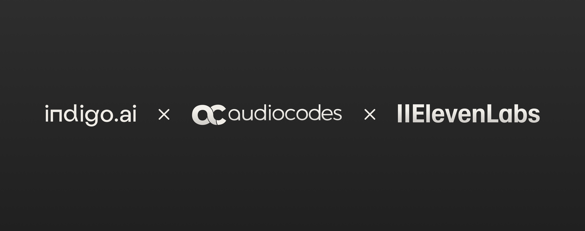

# Voice

<figure><figcaption></figcaption></figure>

Released in March 2025, the Voice Channel adds a new layer of interaction to the indigo.ai platform, allowing your virtual assistant to **handle conversations via voice** over the phone and, soon, directly in web chat.&#x20;

This channel uses **text-to-speech (TTS)** and **speech-to-text (STT)** technologies to power real-time voice interactions, making conversations more natural, fluid, and accessible for users who prefer speaking over typing.

Thanks to **high-quality** voice synthesis and remarkably **low latency**, the experience feels fluid and responsive, especially in Italian where performance has reached impressive levels. This makes the Voice Channel an ideal solution for delivering fast, accessible, and more human-like support.

## Key Benefits

Voice assistants are becoming part of daily life: over 70% of users in Italy interact with voice technologies regularly. Meanwhile, the **phone** remains one of the most widely used customer service channels. With our Voice Channel, you can:

* **Offer support 24/7** across any region or language (thanks to a voice library with 100+ language options).
* **Speed up response times**, reduce waiting queues, and **scale your service** without compromising quality.
* **Handle complex use cases** like FAQs, support ticket creation, or CRM integrations - all through a natural voice interface.

Unlike traditional voicebots that rely on rigid scripts, our AI Agents are:

* **Specialized and dynamic**: Each Agent is trained to handle a specific task (e.g., order status, appointment booking), ensuring accurate and relevant answers.
* **Fully integrated**: Voicebots can connect with your backend systems (e.g., CRM, ERP) to retrieve or update information in real time. This allows for advanced interactions such as booking appointments, answering FAQs, collecting and modifying user details, managing support requests, and guiding users through complex workflows—all through voice.

## 🗣️ Customizable Voice Experience

Thanks to integrations with **ElevenLabs** and **AudioCodes**, you can **personalize your assistant’s voice** to match your brand, choosing from a range of tones, accents, and speaking styles to create a consistent, engaging customer experience.

## How It Works

With the Voice Channel, you can now:

* **Connect your virtual assistant (workspace) to a phone line** to **answer incoming calls or initiate outbound ones**, respond in **real time** with a human-like voice, and automatically complete tasks during the conversation.
* **Leverage the same setup you already know**—using Agents, Workflows, and Triggers—so there's no need to learn new tools.
* **Test and optimize your voicebot in chat** before deploying it via phone, ensuring quality and reliability.


**📱 Voice on Phone & Web**

Currently, voice functionality is available for **phone-based conversations**.&#x20;

We’re also actively working on **bringing voice to our Web Chat**, allowing users to speak to the assistant directly within the chat window...stay tuned!


**Want to activate the Voice Channel for your workspace?**

[Contact us](../../need-help/our-customer-success-team.md) and we’ll help you get started.
