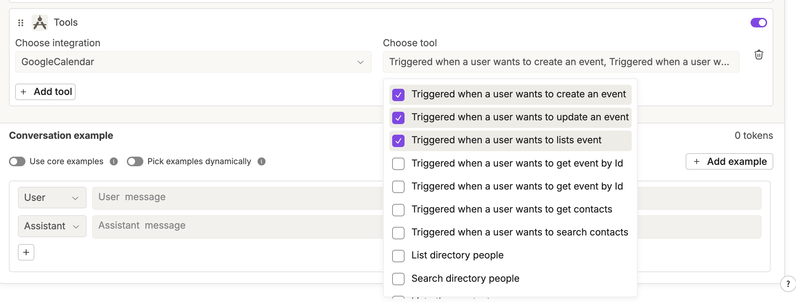

# Tools

#### Tools Settings

The Tools settings section, located under **Agent settings**, allows you to transform any API service documented with the OpenAPI standard into a tool.
\
Once created, these tools can be assigned to agents or used in API blocks, enabling seamless integration with external systems and services directly within your workspace.

<figure><figcaption></figcaption></figure>

#### Tools in Agents

Inside each Agent block, a new Tools section lets you assign specific tools to that agent.&#x20;

<figure><figcaption></figcaption></figure>

The tools available are only those previously activated in the Integrations settings.

* The first dropdown allows you to select the provider (e.g., Google Calendar).
* The second dropdown lets you choose the action offered by that provider (e.g., Create a new event).

<figure><figcaption></figcaption></figure>

This way, the agent can perform the configured action whenever it is triggered in a conversation.\
You can also add multiple integrations using the + Add tool button.

\
**Tools in API Blocks**

External integrations can also be used in the API block. Beyond the usual custom API calls, you can now use preconfigured actions from the tools enabled in the Integrations section.

To access this feature, simply enable the new Use integrations toggle in the API block.

<figure><figcaption></figcaption></figure>

Once enabled, you’ll be able to select both the provider and the action to be executed.

<figure><figcaption></figcaption></figure>


Note: within an API block, only one action per integration can be selected.


### How to Create a Custom Tool

Creating a custom tool allows your agents to connect with any external API service documented with an OpenAPI specification.

1. Go to Tools settings\
   Open the Tools settings section under Agent settings.
2. Click Create custom tool\
   Start the configuration process for a new tool.
3. Import the OpenAPI schema\
   Paste the OpenAPI specification of the service you want to connect.\
   This defines the available endpoints, methods (e.g., GET, POST), and parameters.
4. Configure authentication\
   If the external service requires authentication (e.g., API key, OAuth), specify the details during setup.
5. Save the configuration\
   The custom tool is now available in your workspace and can be assigned to agents or used in API blocks.

<figure><figcaption></figcaption></figure>
