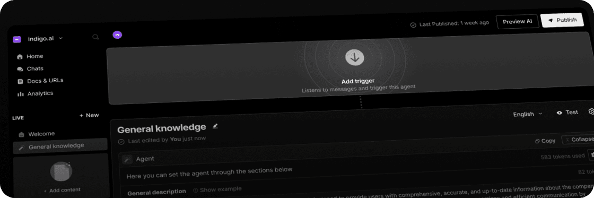

# Introduction to indigo.ai

indigo.ai is an innovative **conversational AI platform** that helps businesses **enhance their customer experience** by **quickly and easily** creating **advanced AI Agents**.

Our platform allows you to provide real-time, accurate responses, automate processes, and seamlessly integrate with your existing systems.

Powered by the advanced generative capabilities of **top Large Language Models (LLMs)** like OpenAI, Gemini, Anthropic, and others, our platform is:

* **Fast**: Build AI Agents quickly and efficiently—no deep technical skills needed.
* **Simple**: Easy to set up, manage, and scale.&#x20;
* **Customizable**: Fully adaptable to your brand's unique communication style and business needs.
* **Versatile**: Engage with customers across multiple channels and interaction modes, including web chat, eCommerce platforms, WhatsApp, mobile apps, CRM systems, and even voice for phone support and contact center automation.

<figure><figcaption></figcaption></figure>

With indigo.ai, you can build a team of AI agents specialized in different business functions. Think of it as having a network of tailored "ChatGPT" agents, coordinated by a central "Mother Agent" that routes each query to the right expert. This system ensures **accurate, consistent responses** that align with your **company’s policies**.

Our platform easily **integrates with your data sources**—like CRM and CMS—via APIs, allowing agents to **access and use your business-specific knowledge**. This results in a personalized solution that boosts efficiency, reduces costs, and improves customer satisfaction.

Thanks to its **low-code design**, indigo.ai is easy for marketing, customer care, and operations teams to use, giving them full control over customizing interactions.&#x20;

With indigo.ai, you maintain complete **control** over AI-driven conversations, ensuring they stay aligned with your brand’s voice and communication standards for an optimized customer experience.


New to AI concepts like LLMs or conversational AI? \
Check out this introductory article that explains the basics: [ai-knowledge-hub](../ai-knowledge-hub/ "mention").&#x20;


Our platform is built with **security and compliance** at its core, fully aligned with standards such as ISO 27001, GDPR, and the AI Act. You can find all related documentation and details in this section: [security-compliance-and-trust](../security-compliance-and-trust/ "mention").&#x20;

### 🤖 A Collaborative AI Agents Workforce

An AI Agent is a sophisticated software program capable of interacting with its environment, gathering data, and executing tasks to meet pre-defined goals. Unlike traditional AI bots, which follow scripted responses and often result in rigid interactions, AI Agents are autonomous problem-solvers that work alongside or even on behalf of humans.

At indigo.ai, **our approach stands apart from traditional solutions**:&#x20;

* Decision-tree-based chatbots → Limited, rigid interactions that can't scale or handle complex queries.
* Basic GPT wrappers → Unpredictable responses that may contradict your company’s policies and lead to errors.

🟣 Rather than relying on a single AI Agent for all tasks, we use a collaborative AI Workforce: **a team of specialized agents, each with its own expertise and knowledge base**, working together seamlessly.

At the heart of this system is the "Mother Agent", which orchestrates interactions and delegates queries to the most suitable specialized agent.

This approach dramatically **reduces AI hallucinations** (misleading or incorrect responses), ensuring higher accuracy and efficiency compared to a single-agent system. As a result, you'll experience improved performance, higher conversions, and significantly enhanced customer experience.

### 🎯 What You Can Achieve with AI Agents&#x20;

AI-powered agents can transform user engagement, reduce wait times, improve customer satisfaction, and lighten the workload of your support teams.&#x20;

#### ✅ Key Benefits for Your Business:

* **Enhanced Customer Experience**: Provide fast, accurate, and empathetic responses 24/7, with no wait times.
* **Intelligent Automation**: Reduce team strain, optimize time, and cut costs.
* **Increased Conversion Rates**: Personalize conversations to drive purchases or generate leads.
* **Total Control & Compliance**: Ensure AI agents work in a secure, policy-compliant environment.
* **Applicable Across B2C, B2B, and Internal Clients**: Benefits extend to distributors, agents, and IT helpdesks.

#### **🏆** Use Cases Across the Customer Journey&#x20;

indigo.ai's AI Agents can support multiple business functions, including:

* **Lead Generation**: Engage potential customers, collect and enrich leads with valuable data.
* **Customer Data Collection**: Gather insights through interactive questionnaires.
* **Booking Services**: Allow users to schedule appointments through text or voice.
* **Sales Assistance**: Recommend products, search catalogs, and facilitate purchases.
* **Pre-Sales Support**: Assist with inquiries and guide potential customers.
* **Post-Sales Support**: Handle order requests, renewals, and upselling to boost retention and revenue.
* **Process Automation**: Automate repetitive tasks, freeing your team for more valuable work.

#### 📈 Measurable Business Impact & Deep Customer Insights&#x20;

Implementing AI agents helps improve key metrics:

* **Higher Automation**: More requests fully handled by AI.
* **Better Customer Experience**: Faster, more effective support.
* **Cost Savings**: Reduced workload for support teams.
* **Revenue Growth**: AI-driven lead qualification, product recommendations, and checkout assistance.

AI-powered agents also help you **gather valuable insights into user needs and behaviors**. With built-in analytics, you can:

* Identify frequently asked questions and uncover customer pain points, revealing opportunities to improve products and services.
* Analyze customer sentiment to understand how users feel about your brand and refine customer personas without traditional surveys.
* Automatically track your agents' daily performance and analyze individual chats to optimize conversations.
* Detect vulnerable topics with lower satisfaction ratings and proactively address them.

#### 📌 Real-World Impact Examples

* **Telepass**: AI improved conversion rate by +13%.
* **Unobravo**: Reduced contact rate by 70%.
* **Beko**: Achieved 89% automation, reducing ticket creation to 5%.
* **Lavazza**: AI in global eCommerce with a CSAT of 4.4/5 and over 80% automation.

#### 🌐 Versatility Across Industries&#x20;

AI-powered agents are industry-agnostic and can be applied in various sectors. \
We have successfully deployed AI solutions for clients in education, healthcare, finance, retail, logistics, and more.

### 📚 Powering AI Agents with Advanced Knowledge Management

What makes all these use cases possible and enables AI agents to be so versatile is our Advanced Knowledge Management system. For AI agents to perform effectively across different industries and functions, they need to be trained with the right knowledge.&#x20;

**The success of AI Agents heavily depends on well-structured content**, as they rely on it to take actions and respond accurately. A properly organized knowledge base ensures AI agents can deliver the best possible results.&#x20;

Our system allows you to:

* **Upload documents, integrate URLs, and build a comprehensive knowledge base**.
* **Ensure AI agents always consult the latest information**—guidelines, best practices, examples—before responding or taking action.
* **Continuously refine and expand the knowledge base** to maintain accuracy and relevance.

There are no limits on the topics AI agents can work with, thanks to our cutting-edge RAG (Retrieval-Augmented Generation) techniques. These technologies ensure that AI agents can retrieve, process, and apply relevant information efficiently, providing accurate and context-aware responses in real time.


👉  Check out our dedicated guide where we outline key success factors and best practices to ensure optimal AI performance: [create-your-knowledge-base](../../build-your-ai-agents/create-your-knowledge-base/ "mention").


### 🎛️ Full Control and Customization

Achieving excellence in digital customer interactions requires both precise control over your AI Agents’ behavior and the flexibility to customize every aspect of their performance and look\&feel.

#### Control

Gain complete control over your AI Agents’ responses and actions to ensure consistency and adherence to your business standards:

* **Content Control:** Fine-tune your AI Agents’ responses to maintain precise communication. Specify exactly what they should say—or avoid saying (e.g., replace “disease” with “condition”)—to reinforce your brand’s voice and maintain consistency.
* **Advanced Reasoning**: Set rules for generating responses that match your business goals and logic.
* **Human Handover**: Easily transfer sensitive tasks to human operators, ensuring a personal touch for complex or delicate issues.
* **Policy Adherence**: Train AI Agents to follow your company’s protocols for complaints, returns, and other critical tasks, ensuring efficient and accurate resolutions.

#### Customization

Customize your AI Agents perfectly represent your brand's identity and communication style, ensuring a personalized and engaging user experience:

* **Branding:** Adapt visual elements such as colors, logos, and overall design to reflect your brand identity.
* **Tone of Voice:** Define how your agents communicate—formal, informal, friendly, or professional—matching your brand's personality and values.

By combining comprehensive control and robust customization, indigo.ai ensures your AI Agents not only reflect your brand’s identity but also communicate in a way that aligns perfectly with your values and messaging.

### 🌍 AI Agents That Communicate Anywhere, in Any Language

Our AI agents can be deployed across multiple **communication channels**, allowing you to engage users where they are most active.

* **Web Chat:** The simplest and most commonly used option—easily installable on your website.
* **Messaging Apps:** Deploy AI agents on **WhatsApp, Telegram**, and other chat platforms.
* **CRM Integration:** Bring AI-powered conversations into your **Zendesk, HubSpot, Salesforce**, or other CRM tools to streamline customer interactions.
* **Voice:** Enable users to **speak directly** with AI agents via phone calls or web-based voice interactions, connecting with call centers or IVR systems.

Additionally, our platform supports **over 100 languages**, making it a **globally scalable solution** for businesses looking to expand their AI-driven customer engagement.


👉 Learn more about available communication channels and multilingual capabilities in these articles: [communication-channels](../communication-channels/ "mention"), [multilingual-capabilities.md](../multilingual-capabilities.md "mention").


### 🔗 Seamless System Integration

Our AI agents seamlessly integrate with a wide range of tools and systems, enabling them to **retrieve data directly from your existing databases, CRM, CMS, and APIs**, ensuring that conversations are powered by real, up-to-date information.

But they don’t just pull data—they can also perform actions within your systems, such as opening or enriching support tickets, searching and browsing your e-commerce catalog, creating or modifying data in a database, and updating CRM or ERP records.

#### Bidirectional Integration for Real-Time Data Sync

Ensure data consistency and streamlined workflows across your systems by enabling AI Agents to retrieve and update information in real time. This eliminates manual effort, synchronizes all platforms, and empowers your agents to manage complex tasks effectively.

#### Available Integrations

Our AI agents are compatible with a wide range of business tools, including Google Workspace, Salesforce, HubSpot, SAP, Shopify, Microsoft Dynamics and more.&#x20;


For a full list of integrations and setup details, check out our dedicated guide: [integrations.md](../integrations.md "mention").


### 🚀 Ready to Build Your Agents?

Read the next article to discover how our **simple, no-code platform** allows you to build, customize, and manage AI agents effortlessly—no technical expertise required.
