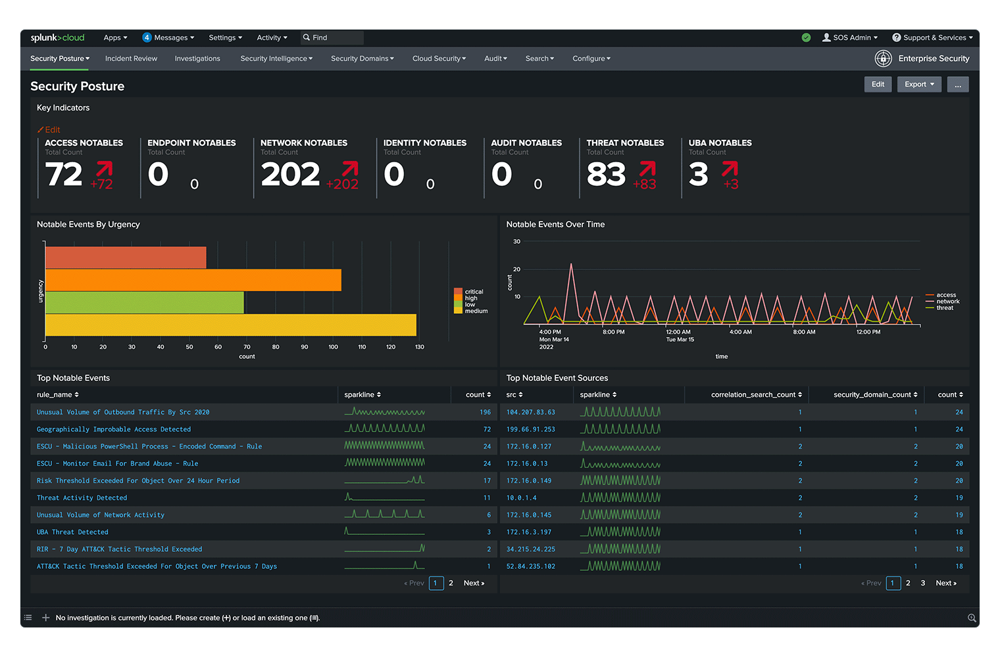

# Audit Logs: Full Transparency for Your Security Operations

​Audit logs are essential for businesses aiming to maintain visibility and transparency over their operations.&#x20;

At indigo.ai, we provide comprehensive **audit logging capabilities through direct integration with** [**Splunk**](https://www.splunk.com/)—a leading platform for monitoring, analyzing, and visualizing machine-generated data in real time.

With this integration, **every action performed within the indigo.ai platform is tracked and logged externally via Splunk**, providing a **complete, verifiable trail of user activities**. This setup ensures your team can monitor system behavior, investigate incidents, and meet compliance requirements with ease.

<figure><figcaption></figcaption></figure>

<figure><figcaption>
Splunk Security Software
</figcaption></figure>

## Key Benefits

Audit logs serve as a critical tool for compliance, security, and troubleshooting. They give you the visibility needed to ensure that all actions, from user access to changes in workflows and AI agent activities, are documented and easily accessible.&#x20;

Integrating indigo.ai with Splunk for audit logging offers several advantages:​

* **Enhanced Security**: Monitor every action within your platform to swiftly detect unusual behavior or potential security breaches.
* **Compliance**: Maintain detailed records of user activity to meet compliance standards such as GDPR, ensuring proper handling of sensitive data.
* **Efficient Troubleshooting**: In the event of an issue, audit logs provide a clear history of activities, making it easier to pinpoint what went wrong and when.&#x20;

The Audit Logs feature isn’t just about internal security—it's also about empowering you to **take control of your data and operations**. Whether you're tracking user access, monitoring changes in workflows, or reviewing the actions of AI agents, you have a complete and secure view of what’s happening in your platform at any time.&#x20;

By leveraging Splunk's robust capabilities, you gain a comprehensive and secure view of all activities within your indigo.ai platform, empowering you to manage and safeguard your operations effectively.​
