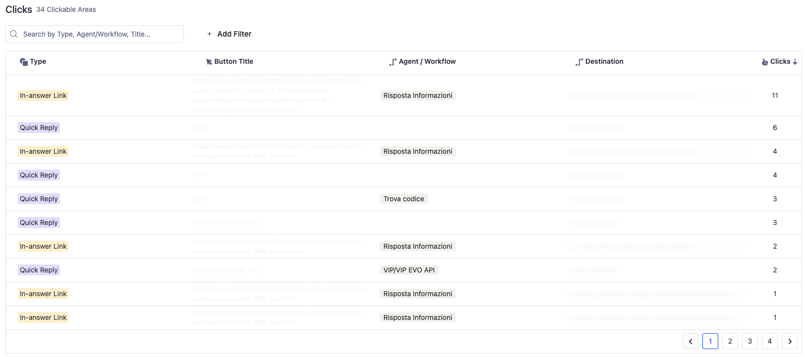

# Analytics

Monitoring your virtual assistant’s performance is essential for understanding how it’s functioning, identifying areas that need improvement, and ultimately enhancing the user experience. To help you manage and optimize your assistant, we've created a dedicated Analytics section within the platform that allows you to **track various key performance indicators (KPIs)**.

With Analytics, you can **gain actionable insights into how users interact with your assistant**, **measure success**, and **make informed decisions to refine your workflows**. The data you collect in this section will guide your decisions to improve the overall efficiency and quality of your virtual assistant's service.

The Analytics section is divided into several insightful **modules**, each designed to provide specific data points related to user interactions, performance, and more.

<figure><figcaption></figcaption></figure>

## 👥 Users

Track the number of unique users who have interacted with your assistant. This metric is broken down by the device and browser used for interaction. If a user switches devices or browsers, they are counted as a new user.

Additionally, this module distinguishes between **new users** (those interacting for the first time) and **distinct users** (those who have interacted previously). This helps you monitor the reach and adoption of your assistant.

## 💬 Messages

This module counts the number of messages sent by each user during their interaction with the assistant. It helps you understand how engaged users are, the volume of conversations, and the type of interactions taking place.

## 💬 Chats

The **Chats** module tracks the number of chat sessions initiated by users. A session is defined by a user starting and ending a conversation. If a user opens the bot in another window or page, it counts as a new chat. This is especially useful for understanding how often users return and how long each session lasts.

_Note_: The session concept can differ depending on the channel, such as **voice** or **WhatsApp**. For more details on how sessions are counted per channel, contact us!

## 👥 Handover

The **Handover** module provides insights into how users request human intervention during a conversation, whether through **Human Takeover** or ticket creation.

Here are key KPIs displayed:

* **Human Handover Rate**: Percentage of users requesting to speak with a human operator.
* **Chats with Requests**: Total number of chats where a human takeover was requested.
* **Chats without Requests**: Total number of chats without any human intervention requests.

#### Breakdown of Requests:

* **Direct Requests**: Number of times users explicitly requested to speak with a human.
* **Requests After Fallback**: Instances where users requested a human after an AI-generated response failed.
* **Request After Operator Button**: Instances where users pressed a quick reply to request an operator after an automated response.

## 🔄 Engagement

This module helps you track user engagement and retention by distinguishing between **new** and **returning users**. The following KPIs are available:

* **Returning Rate**: The ratio of returning users to total users, indicating how often users come back to engage with the assistant.
* **New Users**: Represents the number of users who interacted with the assistant for the first time.
* **Returning Users**: Users who have previously interacted and return to chat again.

<figure><figcaption></figcaption></figure>

## 👍👎 Feedback

The **Feedback** module gives you insight into how users evaluate your virtual assistant’s performance. This data is captured through thumbs-up (👍) or thumbs-down (👎) feedback on responses.

You can track:

* **All Reviewable Requests**: The total number of requests that received feedback (positive, negative, or neutral).
* **Positive Feedback**: Number of positive ratings (👍).
* **Negative Feedback**: Number of negative ratings (👎).
* **No Feedback**: Responses that did not receive any feedback.

You can also filter chats based on feedback types, such as **more positive**, **more negative**, or **only positive** feedback.

## 🫶 User Satisfaction

Track the **Customer Satisfaction (CSAT)** score provided by users at the end of a conversation. This is measured on a scale from 1 to 5, where:

* **1** means "Very Unsatisfied" 😠
* **5** means "Very Satisfied" 😍

The **User Satisfaction** module allows you to view:

* **CSAT Score**: The average of all CSAT ratings provided by users.
* **Total Number of Votes**: Total number of CSAT ratings collected.

## 🚦 Traffic

<figure><figcaption></figcaption></figure>

The **Traffic** module shows the frequency of messages exchanged over a specified period. You can see which days of the week and which hours have the highest levels of interaction, helping you understand peak times and user engagement patterns.

## 👆 Clicks

<figure><figcaption></figcaption></figure>

Track the performance of any clickable elements within your chatbot. This includes links, quick replies, and other clickable items.

You’ll see:

* **Click Type**: Whether it's a Quick Reply button or an In-Answer Link.
* **Button Title**: The label or text associated with the clickable item.
* **Destination**: Where the button links to, such as another answer, URL, or a phone number.
* **Clicks**: The total number of times a button or link was clicked.

Filters allow you to focus on specific clicks, and you can sort data by click volume to identify the most frequently clicked elements.

## 🤖 Agents/Workflows

<figure><figcaption></figcaption></figure>

In the Agents/Workflows module, you can analyze the **most frequently triggered agents or workflows**. This gives you insight into which areas of your AI Agents are being **interacted with the most** and **how well they are performing**.

Key information includes:

* The **number of views** for each agent or workflow
* **Thumbs-up/down feedback** for each agent or workflow


#### 📊 Exporting Data

Currently, data cannot be downloaded directly from the platform. However, you can access analytics data through the **platform's API** for further reporting and analysis. If you require access to API data, please see this documentation for more information: [integrating-with-our-platform-api.md](../../integrating-with-our-platform-api.md "mention").&#x20;

