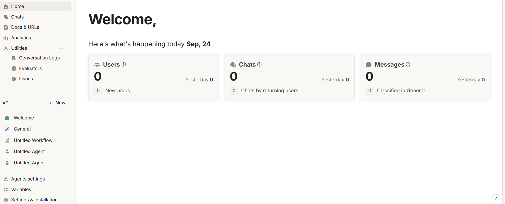

# Utilities

The Utilities section gives you access to advanced tools that help you analyze, evaluate, and optimize your virtual assistant. It is designed for teams who need deeper insights into conversations and effective ways to improve performance.

Inside Utilities you’ll find:

* [**Conversation Logs**](conversation-logs.md) → a complete view of each conversation, with details on messages, duration, feedback, and Evaluator results.
* [**Evaluators**](evaluators-and-guardrails.md) → tools to measure the quality of interactions, track sentiment, satisfaction, and other key aspects, with both built-in and custom options.
* [**Issue Tracker**](issue-tracker.md) → a centralized dashboard to capture, monitor, and resolve issues whenever a conversation doesn’t meet expectations.

<figure><figcaption></figcaption></figure>
