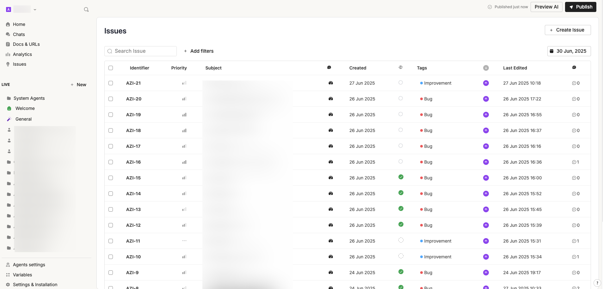

# Issue Tracker

The Issue Tracker is your control center for **monitoring and managing issues related to your virtual assistant**. Whether it's a bug report, a feature request, or an improvement suggestion, this section helps you stay on top of everything that requires attention.


**New Feature**\
The Issue Tracker was released in **June 2025** and is currently in **beta testing**. Learn more about this new feature here: [issue-tracker-for-tests-and-improvements.md](../../../../product-updates/latest-product-releases/issue-tracker-for-tests-and-improvements.md "mention")


### 🔍 The Issue Tracker Dashboard

The dashboard offers a streamlined view of all open, in-progress, and resolved items in your workspace.

<figure><figcaption></figcaption></figure>

Each issue is displayed in a table format with key details:

* **Identifier** – A unique code like `AZI-20`, automatically generated.
* **Priority** – Visual indicators (e.g., bar icon 📶) show urgency (Low, Medium, High).
* **Subject** – The issue title for quick recognition.
* **Created / Last Edited** – Track timestamps for audit and update history.
* **Tags** – Labels like “Bug” or “Improvement” for classification.
* **Comments** – Indicates collaboration level on the issue.

You can also:

* Use the **search bar** 🔍 to locate specific issues.
* Apply **filters** ➕ to narrow down by status, tag, or date.
* Click **Create Issue** to open a new issue form.
* Use the **calendar selector** 📅 to explore issues on specific dates.

### 📝 Creating a New Issue

Click the **“+ Create Issue”** button at the top right of the dashboard.

<figure><figcaption></figcaption></figure>

From here, you'll access a form where you can enter all necessary details:

* **Subject** – Title of the issue.
* **Requester** – Who reported it.
* **Assignee** – Person responsible for resolving it.
* **Source** – Environment (e.g., Production).
* **Priority** – Set importance (High, Medium, Low).
* **Status** – Track workflow (Backlog, In Progress, Resolved).
* **Tags** – Add context (e.g., Bug, Improvement).
* **Description** – Add a detailed explanation of the problem or feature.
* **Comments** – Discuss directly within the issue thread.

You can edit or delete any issue using the respective **“Edit”** or **“Delete Issue”** options at the bottom of the issue detail view.

<figure><figcaption></figcaption></figure>

### 🔄 Managing and Prioritizing Work

Once created, issues move through different stages:

1. **Backlog** – Newly created items awaiting triage.
2. **In Progress** – Actively being worked on.
3. **Resolved/Closed** – Completed or no longer needed.

Use **Tags** to group issues into themes like:

* **Bug** – Technical issues or malfunctions.
* **Improvement** – UX enhancements or backend optimizations.
* **Feature** – New functionalities or requests.

Assigning a **priority level** ensures high-impact items get tackled first. This is especially useful for large teams or complex environments.

### 💬 Collaboration and Transparency

Each issue supports a comment thread, making it easy to:

* Share updates.
* Ask questions.
* Record decisions.

This ensures everyone stays aligned—no need to jump into external tools or chats.

### ✅ Best Practices

* **Keep descriptions detailed** so assignees understand the context.
* **Use tags consistently** for better filtering and reporting.
* **Update status and priority** regularly to reflect current progress.
* **Encourage commenting** to keep communication centralized.
