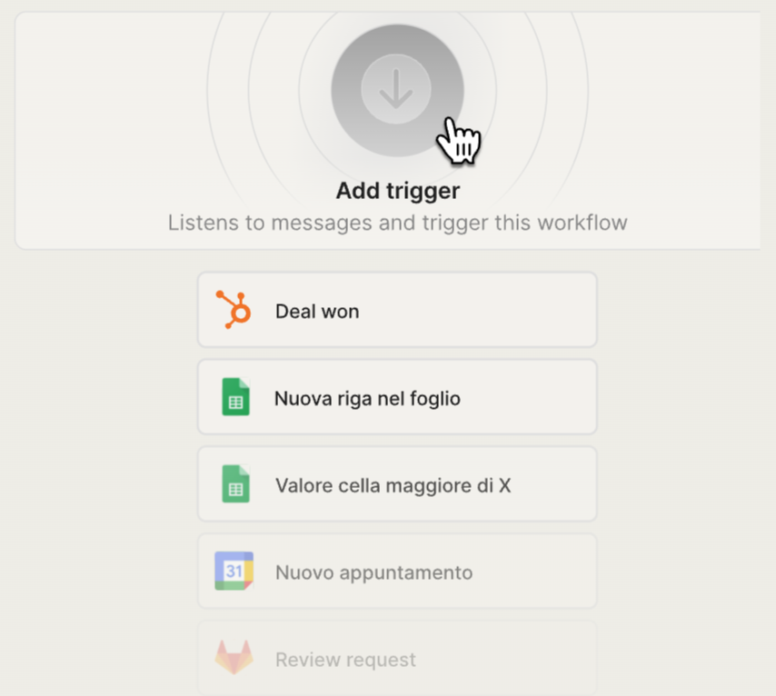

# Non-Conversational Triggers

## Make Your Agents React to External Events

Until now, your **AI Agents** on indigo.ai were already capable of being **triggered by external systems**, but setting this up required custom configuration and technical workarounds. \
With the launch of Non-Conversational Triggers as a **native feature**, setup is now faster, cleaner, and **accessible directly via our Platform API**.

Your **agents can now be activated by real-world events happening outside the conversation** (no user message required). Whether it's a new lead in your CRM, a scheduled event in your calendar, or a ticket update in your help desk, your AI Agents can **jump into action the moment something important occurs**.

This opens the door to a **whole new set of automations and use cases**, bringing the power of AI even closer to your business logic.


This feature is **only available via our Platform API**. There is no front-end interface for External Triggers.


<figure><figcaption></figcaption></figure>

## Why It Matters

* **Automation beyond the conversation:** Trigger your Agents with events from any external system, including CRMs like **Salesforce, HubSpot, Zendesk**; e-commerce platforms like **Shopify**; ERP systems like **SAP or Microsoft Dynamics**; collaboration tools like **Google Workspace**; and automation platforms like **Zapier**.
* **Real-time reactions:** From customer support updates to lead management workflows, Agents react instantly, without waiting for user input.
* **More business use cases covered:** Whether you're in customer service, logistics, sales, or post-sales support, this feature opens up powerful new automation scenarios.

### Example Use Cases

#### Post-Sales Assistance (Customer Service)

* **Trigger:** A support ticket is updated in Zendesk or HubSpot after a product delivery issue.
* **Action:** An indigo.ai Agent analyzes the case details, checks the internal database, and immediately contacts the customer to confirm receipt of the issue and offer solutions, such as scheduling a return or initiating a refund.

#### Lead Enrichment (Marketing & Sales)

* **Trigger:** A new lead is captured through a Zapier flow connected to a website form.
* **Action:** The AI Agent receives the lead’s details, enriches the profile by cross-checking internal records or external data sources, and sends a complete lead summary to the sales CRM for follow-up.

## ⚙️ How It Works

Trigger any Agent or Workflow in your workspace using a simple **HTTP request (webhook)** from an external system. Two modes are supported:

* `Async`: "fire-and-forget"; Ideal when you don’t need a response from the AI.
* `Sync`: waits for the AI's response before returning it. Perfect for validation flows or real-time content generation.

These webhooks can be configured in external platforms (e.g., GitLab, Zapier, Make) to send data to indigo.ai whenever an event occurs, like creating a calendar event, merging a pull request, or opening a ticket.

Once triggered, your Agent or Workflow can process the data received in the payload, apply logic, and perform actions or return a structured response.

### Smarter Variables Too

To support complex payloads passed via external triggers, we've introduced two new variable types:

* **Map** (JSON object): store and manage nested key-value pairs
* **List** (array): store sequences of data, including other maps

These let your AI handle structured data cleanly and efficiently, perfect for use cases like parsing event data, looping through ticket fields, or mapping complex CRM records.


All the details on the new variables are available here: [#deep-dive-map-and-list-variables](../../getting-started/workspace/variables/#deep-dive-map-and-list-variables "mention")


### 🔗 Updated API Documentation

This release is powered by our newly overhauled [**indigo.ai Platform API**](../../integrating-with-our-platform-api/), built on GraphQL and designed for speed, flexibility, and enterprise-scale integrations.

Check out our updated API documentation to:

* Access webhook endpoints and schema definitions
* Learn how to structure your payloads
* Explore sync vs async trigger use

**📘** [**Visit the API Docs**](https://platform.indigo.ai/graphql)


API access is a **premium feature** and may require a license upgrade. [Contact our Customer Success team](../../need-help/our-customer-success-team.md) to activate External Triggers in your workspace.


👉 **Want to see how to set it up step by step?**\
Check out our technical guide to[ Non-Conversational Triggers](../../integrating-with-our-platform-api/non-conversational-triggers.md) — with REST endpoints, webhook setup examples, and advanced variable management.
