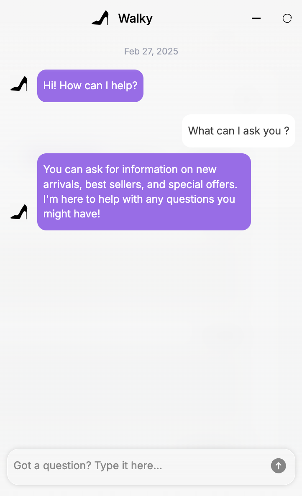

# The Next-Generation Web Chat

We’re excited to release a fresh update to our web chat, transforming every customer interaction into a dynamic and engaging experience.&#x20;

We've **completely reimagined our web chat** from a simple conversation box into a **feature-rich widget with an intuitive homepage, vibrant visuals, and extensive customization options**—empowering you to craft a chat experience that perfectly aligns with your brand.

This upgrade is designed to make every customer interaction not only functional, but also delightful and engaging—helping users quickly understand what they can ask while encouraging deeper interaction. ✨

## What’s New

This latest update introduces three exciting features designed to elevate your web chat experience:

1. **Pre-chat Engagement**: The revamped chat launcher button and pop-up message now capture visitors' attention before they even start a conversation.
2. **Fresh Homepage Concept**: Upon clicking the launcher button, users are greeted with a redesigned homepage that highlights your web chat’s capabilities in a stylish and engaging way. The homepage  supports **clickable images**—each image can optionally link to a conversation flow or external page, giving you even more control over how users interact with your assistant right from the start.
3. **Flexible Conversation Start**: You now have the flexibility to decide whether visitors see the homepage first or jump straight into a conversation with a fully customized assistant that reflects your brand identity.
4. **Session Persistence**: The new widget now **keeps the user session active by default**. If the session is still active and the conversation hasn’t been closed (e.g., after page reloads, navigation, or when switching apps on mobile), previous messages are restored. By default, the session lasts **for 10 minutes**, after which a button appears to start a new chat.&#x20;


These features are optimized for both desktop and mobile!


### 1. Chat Launcher & Pop-up Message

First impressions matter, and with these new features, you can truly customize the initial user interaction:

* **Launcher Button**\
  Choose between a simple icon or a button that combines an icon with custom text for a personalized touch.
* **Pop-up Message**\
  Configure a pop-up message above the widget’s button to invite interaction. Simply adjust the message text and delay to ensure it fits seamlessly with your website’s design.


Pop-up message and launcher button with custom text


### 2. A Smart Homepage for Your Chatbot

The new chat window is more than just a place for conversations—it's a dynamic landing page that showcases your assistant’s capabilities. When users first access your web chat, they are welcomed with a fully customizable homepage that explains what the assistant can do and guides them on how to get started.

**Key Features:**&#x20;

* **Welcome message** 👋\
  Set the tone with a friendly headline.&#x20;
* **Brief Explanation**\
  Provide a concise overview of the topics your assistant can handle.&#x20;
* **Grid of Images**\
  Display popular or frequently searched topics in an image grid. Each image can be made **clickable**, allowing you to assign specific actions:
  * Trigger a bot response or workflow.
  * Redirect to an external link in a new browser tab.
* **Typebar**\
  Enable the typebar at startup and customize its placeholder message.
* **Example Questions**❓\
  Include up to five clickable questions that lead to immediate answers.&#x20;
* **AI Animation** \
  Add an engaging animation above the welcome message, customizable to match your brand’s colors.

Together, these elements create a structured and intuitive experience, helping users find the information they need quickly and easily—without feeling lost.


New Widget Homepage


### 3. Chat Launch & Assistant Identity

With this update, you’re in full control of how conversations start and how your assistant is presented.

* **Decide How the Conversation Begins**\
  Choose whether users will first see the customizable homepage or go directly into conversation mode when they click the web chat launcher button.
* **Assistant identity**\
  Beyond previous features like background color customization for responses, you now have more styling options. You can assign a name to your assistant and select an avatar icon that appears alongside its name and every response.

<figure><figcaption>
Customized agent identity
</figcaption></figure>

## How to Customize and Install Your Widget

To give you full control over these new features, we've completely revamped our web chat installation settings.&#x20;

We now offer **four dedicated customization tabs** that allow you to fine-tune every detail, with a live widget preview that instantly shows your changes in action. ⚙️

Take a look at the new customization options:


A preview of the new widget settings pages



For full details on using the new features and customization settings, please refer to this page: [configure-and-install-the-web-chat.md](../../build-your-ai-agents/configure-and-install-the-web-chat.md "mention").


## ...And There’s More Coming!

We’re committed to continuously improving your web chat experience. Here’s a sneak peek at some exciting new features coming in the next few months:

* **Enhanced Privacy Controls** 🔒\
  Add a clickable privacy policy to your chat and even request explicit user consent.
* **Improved Conversation Management**\
  Users will be able to access their recent conversations and share entire chats with just a click.&#x20;

Additionally, we have exciting plans on our roadmap, including:

* AI-powered image generation and example questions for your web chat homepage.
* The ability to easily install your web chat as a dedicated webpage on your site.
* Voice capabilities, allowing users to interact with your assistant using voice commands.

Stay tuned—these enhancements are designed to make your chatbot even more powerful, intuitive, and user-friendly.
