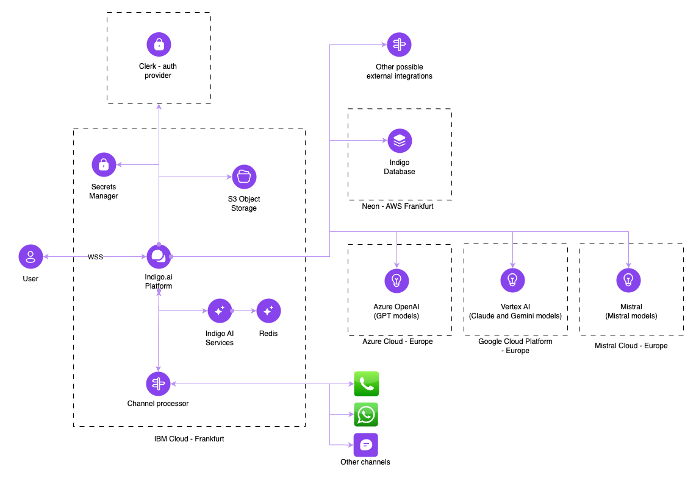

# Product Architecture

## System Architecture Overview

At indigo.ai, we’ve designed a robust, secure, and scalable architecture to support the full lifecycle of your AI Agents—from user interaction to AI processing and response delivery. Our architecture enables seamless data flows, real-time processing, and reliable integrations with Large Language Models (LLMs) and third-party systems.

The indigo.ai technology stack leverages cutting-edge **machine learning models** and **LLMs** to understand and generate natural language. This technology is made easily accessible in the form of a **virtual assistant that can be installed on phone systems, web pages, messaging platforms, and apps, or accessed via API**. Regardless of where the conversation takes place, indigo.ai can manage it seamlessly on both **desktop and mobile**.

The diagram below illustrates the high-level architecture, **hosted primarily on IBM Cloud (Frankfurt)**, and how the platform components interact to process user requests in real time.

<figure><figcaption></figcaption></figure>

## 🧩 Services, Applications, and Technical Components

At the core of the indigo.ai solution is a **cloud-based SaaS platform hosted in the IBM Cloud** (**Frankfurt** region). The platform is composed of:

* **Frontend**: A web-based administrative interface built using a **React microfrontend architecture**.
* **Backend**: Developed in **Elixir**, it exposes **GraphQL APIs** for internal and third-party integrations.

#### Data Management

For **data storage**, the platform relies on:

* **PostgreSQL 16**, managed via **Neon’s serverless service** (hosted in the AWS Frankfurt region), which handles most of the application data.
* **S3-compatible object storage**, also hosted on IBM Cloud, to **store user-uploaded documents and files**.

#### AI Processing

**Advanced AI services** are delivered by a proprietary application also hosted on **IBM Cloud**. This service includes:

* A **Redis-based volatile cache**, used for real-time processing and temporary storage to ensure fast response times.
* Interfaces with top-tier [**Large Language Models (LLMs)**](../getting-started/ai-knowledge-hub/large-language-models-llms-available-on-our-platform.md) (e.g., GPT, Claude, Mistral) hosted in **EU-based data centers**, ensuring full **GDPR compliance** and alignment with current data protection regulations.

#### Secrets Management

Infrastructure and application secrets are managed securely through IBM’s dedicated **Secrets Manager**, which is based on **HashiCorp Vault** technology. This ensures a high level of protection for sensitive credentials and configurations.

#### Web Widget

For end-user interactions, we provide a highly optimized **web widget**, consisting of two JavaScript applications (one native, one built with **Preact**). The widget is designed to be lightweight and performance-friendly, minimizing the impact on hosting websites.&#x20;

All widget assets are served directly from the platform’s backend and communicate with it via a secure **WebSocket (WSS)** channel.

## ⚙️ Technical Specifications

### Communication Interfaces

The primary communication channel is **web-based** and secured via **TLS 1.3**, using a set of strong and up-to-date security protocols. Within the platform:

* The **frontend and backend** communicate through:
  * A **GraphQL API** over HTTPS
  * A secure **WebSocket (WSS)** channel
* Communication with **internal services**—such as AI services, Object Storage, and the Secrets Manager—occurs over **private HTTPS connections**.
* All interactions with **external APIs and third-party services** are performed via **encrypted HTTPS channels**.
* Backend-to-database communication is handled over **native TCP**, encrypted with **TLS 1.2** for secure data transmission.
* The connection between the **backend and the web widget** also uses **encrypted WebSocket (WSS)** connections, secured with **TLS 1.3**.

### Component Dependencies

The core platform service is responsible for the majority of system functionality and has a **primary dependency on the PostgreSQL database** for data storage and persistence.

Other components play supporting roles and are used for specific capabilities:

* **AI services**, **Object Storage**, and the **Secrets Manager** enhance the platform’s intelligence, scalability, and security—but are considered **optional** from a functional standpoint.
* The **AI service** specifically relies on a **Redis database** used as a volatile cache, enabling fast processing and temporary storage of computational results.

## 🔐 Data Security

### Protection Against Unauthorized Access and Data Loss

All infrastructure and services used by indigo.ai are protected with strong credentials, managed securely via **1Password**. Administrative passwords are shared only with essential personnel and always through secure channels.

For **critical systems,** such as core infrastructure, access is strictly monitored. Any action performed using administrative credentials is logged and tracked. Third-party access is granted **only when strictly necessary** and is subject to the same **monitoring and logging policies** applied to internal users.

Access is **segmented by role**, ensuring that each user (internal or external) can interact only with the specific systems and services necessary to perform their tasks. This is especially enforced for systems handling sensitive or critical data.

Operational users are assigned **personalized accounts**, subject to the same security policies as system-level users.

Access reviews are conducted **quarterly** across all systems. Any anomalies identified during these reviews are addressed promptly.

Our **PostgreSQL database** is backed up **daily**, with a **30-day retention policy**. Backup integrity is periodically tested to ensure data can be recovered if needed.

### Encryption and Threat Protection

The platform integrates **real-time security monitoring and threat detection** to safeguard against potential breaches.

All platform code undergoes **continuous static analysis** to identify vulnerabilities early in the development process. This also applies to our **Docker images**, which package the application code and are scanned for known security risks.

All communication between platform components is encrypted using **TLS**, preferably version **1.3** (with **1.2** as the minimum supported). Only the most secure cipher suites are used, in line with **OWASP recommendations**.

The **database features encryption at rest**, with keys managed automatically for optimal security.

### Data Privacy Rules

**All data processed by our AI Agents is stored and managed entirely within our platform.**&#x20;

**Full user messages remain confined to our internal systems.**

In some cases, third-party services may be used to process data or integrate with external platforms. In these situations, the following strict rules are applied:

* Data is **never shared across agents**.
* Data is **never stored by third-party services**: it is used and immediately discarded.
* Data is **never used to train or improve models outside the configured assistant**.
* Data is **never sent to an external service unless explicitly specified** in the assistant’s configuration.


🔎 Want to dive deeper into our security practices, certifications, and compliance with regulations like the AI Act?&#x20;

Check out our dedicated [**Security, Compliance & Trust**](../getting-started/security-compliance-and-trust/) page for comprehensive resources (like our [Trust Center](https://trust.indigo.ai/)), policy details, and tools to manage risk and compliance.


## 👥 Authentication and Authorization

### User Roles and Permissions

The indigo.ai platform includes a robust **user profiling system** that controls access to platform features and sensitive information based on assigned roles.

We support multiple user roles, each with specific permissions:

* **Owner**: Full administrative access, including user management, configuration of the Knowledge Base, and control over all platform features.
* **Admin**: Access to manage platform features and edit or configure the Knowledge Base.
* **Editor**: Limited to viewing **Analytics** and the **Knowledge Base** only.

Permissions can be configured at a **granular level**, granting or revoking access for specific users or roles.&#x20;

The platform includes a built-in **user management interface** that allows you to:

* Invite new users
* Assign or update roles
* Remove user access as needed

This ensures that only authorized personnel can make changes or access critical components—enhancing both security and governance.


To know more about managing workspace access and roles, visit this page for detailed instructions: [settings](../getting-started/workspace-activities/settings/ "mention")


## FAQs

1. **Where is the indigo.ai platform hosted, and can you guarantee data residency within the EU?**

Yes. All core services, including application logic, AI processing, and data storage, are hosted in **IBM Cloud (Frankfurt)** and **AWS (Frankfurt)**—ensuring **full EU data residency**. This setup guarantees compliance with **GDPR** and EU-specific data localization requirements. 

2. **Is indigo.ai hosted on your own infrastructure?**

Yes. The SaaS platform operates on **indigo.ai–managed infrastructure**, primarily in IBM Cloud (Frankfurt) and AWS (Frankfurt) for select services (e.g., Neon DB). There’s no shared hosting with other SaaS providers. 

3. **How does indigo.ai ensure multi-tenancy isolation between clients?**

Each client operates within an **isolated Workspace environment**, with logically separated data and access controls. We enforce strict **role-based access controls** (RBAC) and use unique encryption keys per tenant to prevent unauthorized cross-access. 

4. **How does indigo.ai handle sensitive data collected by AI Agents?**

All user data is **securely stored within our platform infrastructure, hosted in the EU**. **Sensitive data is never shared** between agents or stored by third-party processors. It is used only for the intended session and discarded immediately if processed externally.

👉 For detailed security policies, certifications, and compliance info, visit our [**Security, Compliance & Trust**](https://guide.indigo.ai/getting-started/security-compliance-and-trust) page. 

5. **Are user conversations recorded and stored? For how long?**

Yes, user conversations are recorded and securely stored in a **PostgreSQL database**, with **encryption applied both in transit and at rest** to protect data integrity and confidentiality.

Each conversation is linked to a unique identifier (**UUID**) that allows for session tracking without exposing personally identifiable information. This UUID can be **regenerated** if a user clears their data from their device, supporting user-controlled privacy.

By default, conversation data is retained for **30 days**, after which it is automatically deleted. However, this retention period can be customized based on your specific data governance policies. 

6. **Does indigo.ai use data collected during sessions to train or improve its AI models?**

**No**. Data processed by AI Agents is **never used** to train models beyond the configured assistant. There is no cross-assistant learning or global model training on client data—ensuring full control and confidentiality. 

7. **Is indigo.ai compliant with GDPR?**&#x20;

Yes. Our platform is fully **GDPR compliant**. All processing takes place in EU-based data centers, and we follow strict data handling rules, including transparency, purpose limitation, and user consent management. Our platform also supports compliance with the **EU AI Act** through transparency measures, audit logs, and traceability, tools detailed on our [**Security, Compliance & Trust**](https://guide.indigo.ai/getting-started/security-compliance-and-trust) page. 

8. **How are security audits conducted?**

We conduct regular internal vulnerability scans and static code analysis, perform **third-party audits** (ISO 27001 aligned), and carry out **quarterly access reviews**. Ongoing threat detection and monitoring are also in place. Explore our audit and certification details in our [**Trust Center**](https://trust.indigo.ai/).  

9. **What is the process for applying patches and updates?**

We follow a continuous deployment strategy with automated CI/CD pipelines. Security patches are validated and applied as soon as possible, with real-time monitoring and rollback capabilities to ensure stability. 
